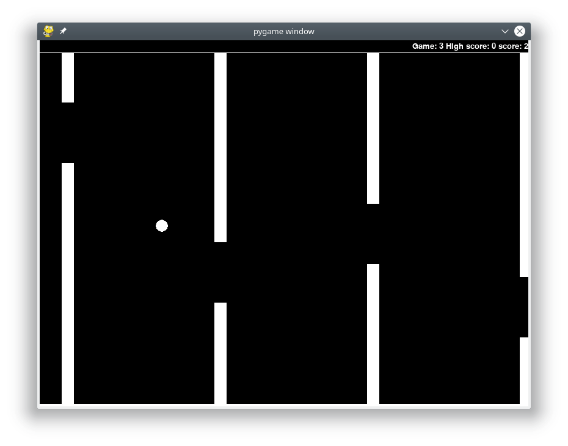
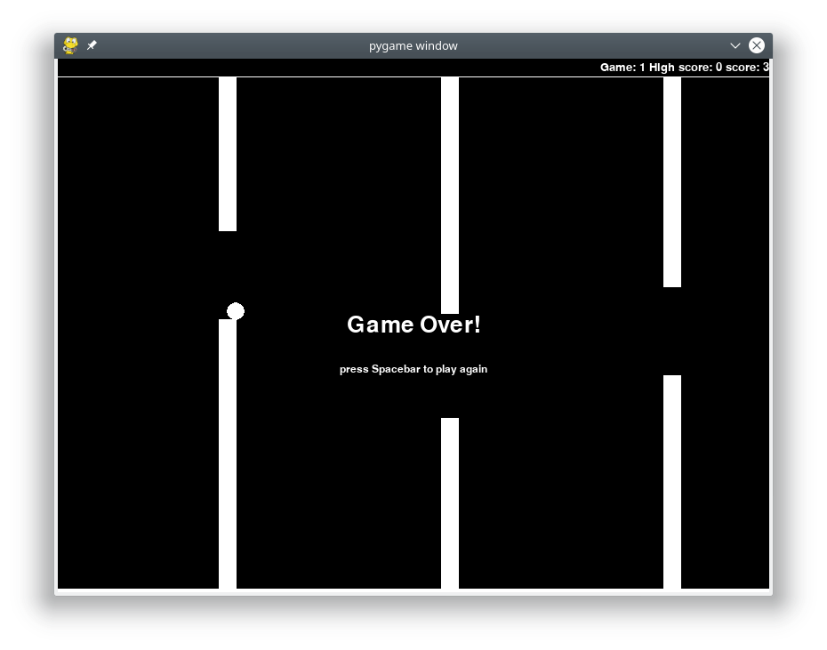

# flappy_bird_exercise
A little coding challenge: build a [flappy bird]("https://flappybird.io/")-like game using pygame. 

To play, download and extract the repository as zip, or clone clone the repository:

```
git clone https://github.com/DanielDondorp/flappy_bird_exercise.git
```

Install the requirements (pygame and numpy):

```
pip3 install -r requirements.txt
```

run the game:

```
cd flappy_bird_exercise
python3 flappy_bird_exercise/game.py
```



